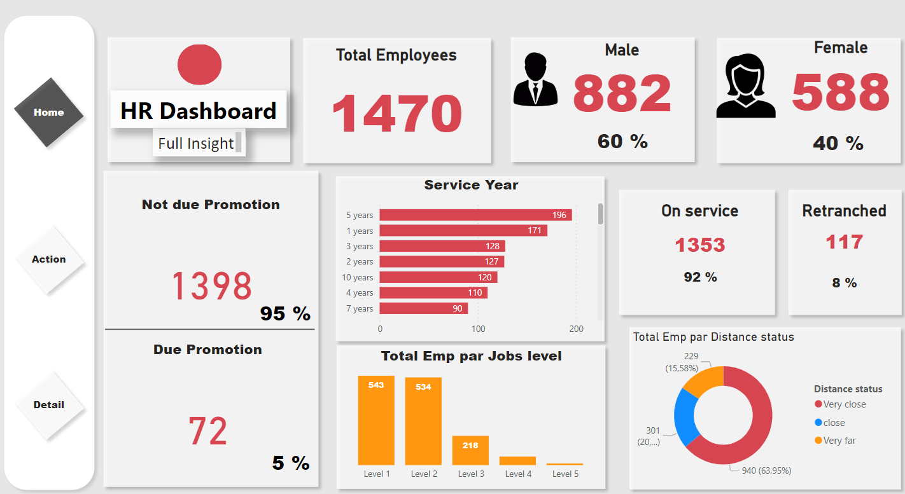

# Dashboard RH - Power BI

## Description
Ce projet Power BI fournit une vue analytique et des tableaux de bord interactifs pour la gestion des ressources humaines. Il inclut un modèle Power BI, des données d'exemple, et une vidéo de démonstration.

## Contenu
- **Dashboard** : `Project RH.pbit` (Modèle Power BI)
- **Données** :
  - `data/data.csv promomtion.xlsx`
  - `data/data.csv Retrenchment.xlsx`
  - `data/HR Analytics Data.xlsx`
  - `data/HR employee data.xlsx`
- **Vidéo** : `video/demonstration.mp4`

## Aperçu des Visualisations
### Tableau de Bord 1

### Tableau de Bord 2

### Tableau de Bord 3

## Instructions
1. Téléchargez les fichiers du projet.
2. Ouvrez `dashboard.pbit` dans Power BI Desktop.
3. Connectez les fichiers Excel à Power BI si nécessaire.
4. Regardez la vidéo de démonstration pour en savoir plus.

## Auteur
Ce projet a été inspiré de data with edition.
